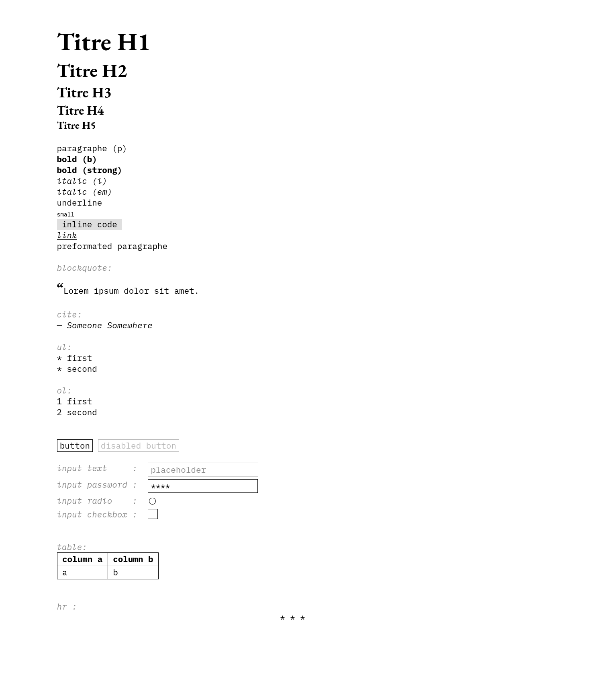
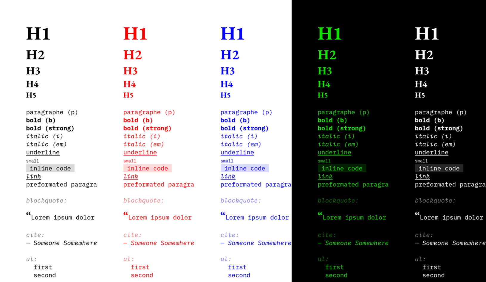

# Specimen : An elegant brutalist drop-in CSS

As a drop-in CSS, simply link the stylesheet by adding the following to your `<head>` :
```html
<link rel="stylesheet" href="https://eloi-menaud.github.io/specimen/style.css">
```
<br>

[🔗 Online page preview](https://eloi-menaud.github.io/specimen/)

<br>



<br><br>

### 2 colors based customisation
Since the theme is based on only two colors, you can easily customize it by redefining `--back` and `--front` :
```html
<style>
html:root{
    --back : #fff;
    --front: #000;
}
</style>
```
Example :

